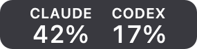
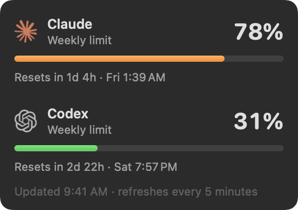

# ClaudeCodexBar

Easy to use and simple Claude and Codex usage bar for macOS.

ClaudeCodexBar shows how much of your **weekly** Claude Code and Codex limits you've used, right in the menu bar. It refreshes every 5 minutes.



## Download

**[Download ClaudeCodexBar.dmg](https://github.com/raresmun/ClaudeCodexBar/releases/latest/download/ClaudeCodexBar.dmg)** (macOS 13 or later, Apple silicon and Intel)

## Install

1. Open the DMG and drag **ClaudeCodexBar** onto **Applications**.
2. Open ClaudeCodexBar. The first time, macOS says it can't verify the app, because the app isn't notarized by Apple. You only need to get past this once:
   - **macOS 15 or later:** click **Done**, go to **System Settings → Privacy & Security**, scroll down, click **Open Anyway** and confirm.
   - **macOS 13–14:** right-click the app and choose **Open**.
3. Look for the Claude and OpenAI logos in the menu bar, each with a percentage next to it. The numbers appear within a few seconds.

If you don't see it, your menu bar is probably full. If your Mac has an arrow that reveals hidden menu bar items, click it, then hold ⌘ and drag ClaudeCodexBar to a visible spot. Otherwise it may be hidden behind the notch, so make room by removing other icons.

To start ClaudeCodexBar automatically when your Mac starts, click it in the menu bar and choose **Open at Login**.

## Requirements

- macOS 13 or later.
- The Claude Code (`claude`) and/or Codex (`codex`) command-line tools, installed and signed in:
  - Claude Code signed in with a Claude subscription, not an API key.
  - Codex signed in with ChatGPT, not an API key.
- ClaudeCodexBar looks for the tools in `~/.local/bin`, `/opt/homebrew/bin` and `/usr/local/bin`. If one isn't found, that side shows `–` and the menu says why.

## Using it

The menu bar shows the percentage of each weekly limit you've used. Click it for the details:



- a card for each tool with its logo, the percentage and a countdown to the reset
- a bar that goes from green to yellow, orange and red as you get close to the limit
- a warning on the card if the last check failed (the last good number stays)
- **Refresh Now** (⌘R), **Open at Login** and **Quit** (⌘Q)

## How it works

There's no login and nothing to set up. ClaudeCodexBar never sees your passwords, tokens or API keys. Every 5 minutes it asks the `claude` and `codex` tools already on your Mac, and they answer using their own saved login. These are the same numbers you see with `/usage` in Claude Code and `/status` in Codex.

- **Claude:** starts `claude` in the background in its stream-JSON mode, sends a `get_usage` control request and reads `rate_limits.seven_day.utilization`.
- **Codex:** starts `codex app-server`, calls `account/rateLimits/read` and uses the rate-limit window that is 7 days (10,080 minutes) long.

Both programs quit as soon as they've answered.

## Privacy and resources

- **Uses no tokens.** A check is a status request, not a prompt. Claude Code reports $0 and zero tokens for it, and Codex never starts a conversation.
- **Sends nothing anywhere else.** ClaudeCodexBar makes no network connections itself. Only `claude` and `codex` contact Anthropic and OpenAI, as they do whenever you use them.
- **Leaves your setup alone.** The Claude check saves no session, doesn't start your hooks, plugins or MCP servers, and turns off Claude Code's update checks and telemetry for that run. Codex updates its own logs and caches, as it does every time it starts.
- **Light.** About 20 MB of memory. Each check briefly runs `claude` (about 200 MB) and `codex` (about 80 MB), usually for 1–3 seconds.

## Build from source

You need Xcode or the Xcode Command Line Tools.

```bash
git clone https://github.com/raresmun/ClaudeCodexBar.git
cd ClaudeCodexBar
./build.sh
```

`build.sh` builds a universal app (Apple silicon and Intel, macOS 13 or later), installs it to `~/Applications`, starts it and creates `ClaudeCodexBar.dmg`. All the code is in one file, [`ClaudeCodexBar.swift`](ClaudeCodexBar.swift), and the two logos are in [`icons`](icons).

## Limitations

- It relies on a Claude Code control request that isn't a public API and on Codex's experimental app server. An update to either tool could break it. If that happens, the menu shows the error and keeps the last good number.
- It shows only the overall weekly limits, not the 5-hour window or the per-model weekly limits.
- The app isn't notarized, so macOS asks you to approve it once (see [Install](#install)).

## License

MIT. See [LICENSE](LICENSE).

The Claude and OpenAI logos come from [Simple Icons](https://simpleicons.org) (CC0). Claude and its logo are trademarks of Anthropic; Codex, OpenAI and the OpenAI logo are trademarks of OpenAI. ClaudeCodexBar is not affiliated with or endorsed by either company.
